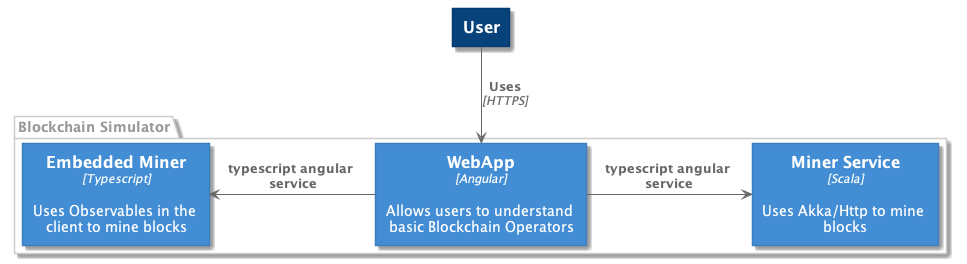

# Performing the Mining Calculation

|Category    | Value    |
|------------|----------|
| Identifier | adr-0001 |
| Status     | Superseded by [0002](./0002-Platform-Containers.md) |
| Author(s)  | Brian Mitchell |
| Date:      | October 21, 2017 |

**keywords:** Runtime, Deployment, Web Services

## Context and Problem Statement

We would like to have this project be used as a demo to showcase some of the interesting blockchain capabilities.  In the real world, consensus-based algorithms are very computationally intensive, and we wanted to simulate creating an architecture that would be suitable and scalable for this type of application.  In order to achieve these objectives the mining operation will be externalized in a REST-based web service

## Considered Options

* Web Service - Externalize computation into an external web service 
* Internal Solver - build the solver in the client application - this might be complex because browsers are single threaded
* Build the internal solver, and an option for communicating with an external web service

## Decision Outcome

Chosen option: **"Build both solvers"**, because

* Users could use the solution without setting up and configuring an external web service, but can also create an external service for enhanced performance.

This is shown below:

