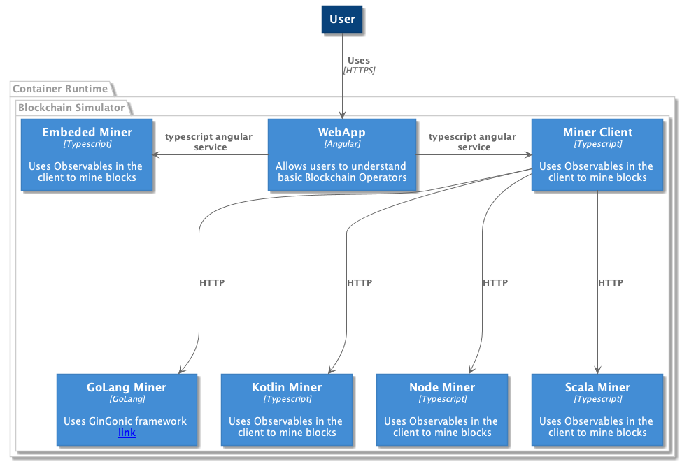

# Blockchain Reference Architecture

## Architecture Overview

The purpose of this project is explore the inter-workings of how a block chain and consensus algorithms work to demonstrate modern architecture and design concepts.  

## Architecture Diagram

## Architecture Components

| Component | Description |
| --------- | ----------- |
| Web App   |  The web application uses the Angular 6 framework and a number of best practices for state management and asynchronous integration with web services.  The Web App is deployed in a container using the Ngenix web server. |
| Miner Client | The Miner client is a library in the main web app that handles routing to a minor implementation, either internal or external via a web service |
| Embedded Minor | This is a typescript implementation embedded in the web client codebase. It uses observables to iterate the calculations versus a long running loop to respect the single threaded model of the browser.  |
| GoLang Miner | A high performance miner written in the go programming language. Concurrency is handled via Go's novel concurrency model - specifically `goroutines` |
|Kotlin Miner | Kotlin is a modern JVM language, one of its unique concurrency and high-performance computing capabilites are based on coroutines.  The Kotlin Miner uses the [ktor](https://ktor.io) framework

